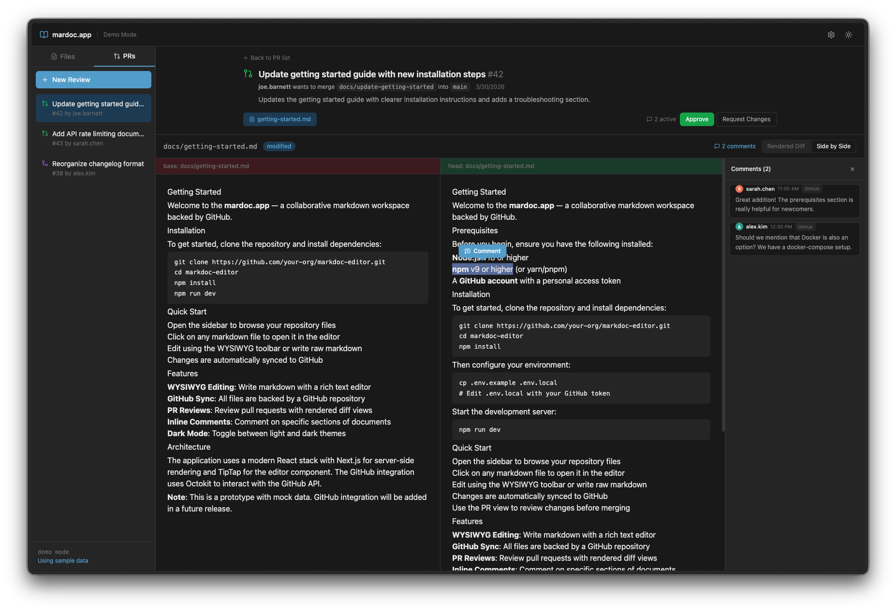

# MarDoc

**Review markdown like a reader, not a developer.**

MarDoc renders your GitHub PR diffs as rich, formatted documents — not raw text with `+` and `-` lines. Select any passage, leave a comment, and have it posted back to GitHub as an inline review comment tied to the exact line range.



## Why MarDoc?

Markdown PRs are hard to review on GitHub. You're staring at raw syntax, mentally rendering headings, lists, and links while trying to evaluate whether the *content* is right. MarDoc fixes that:

- **Rendered diffs** — see what actually changed in the formatted output, with word-level highlighting
- **Inline commenting** — select any text in the rendered view to leave a review comment, anchored to the source lines
- **Side-by-side view** — compare base and head branches as rendered documents
- **Full GitHub integration** — comments post directly to the PR via the GitHub API
- **Dark mode** — because of course

## Who is this for?

- **Technical writers** reviewing docs PRs without leaving their comfort zone
- **Engineering managers** who want to review READMEs and ADRs without decoding diff syntax
- **Open source maintainers** drowning in documentation PRs
- **Anyone** who thinks markdown review should feel like reviewing a document, not reading a patch file

## Quick start

1. Go to [mardoc.app](https://mardoc.app)
2. Click **Connect GitHub** and paste a Personal Access Token (fine-grained, with Contents + Pull Requests permissions)
3. Select a repository
4. Open a PR and start reviewing

No install. No signup. Runs entirely in your browser — your token never leaves your machine.

## Try it first

MarDoc ships with a built-in demo mode. Just visit [mardoc.app](https://mardoc.app) and explore the sample data — no GitHub token required.

## Run locally

```bash
git clone https://github.com/mardoc-io/mardoc-io.github.io.git
cd mardoc-io.github.io
npm install
npm run dev
```

## Built with

Next.js 14, TipTap, Showdown, Octokit, and Tailwind CSS. Hosted on GitHub Pages.

<!-- ## Support MarDoc
<!--
<!-- If MarDoc saves you time reviewing docs PRs, consider supporting development:
<!--
<!-- [Support on Patreon](https://patreon.com/YOUR_LINK)
<!--
<!-- Supporters get early access to upcoming features like Auth0 OAuth login,
<!-- multi-repo dashboards, and collaborative review sessions.
-->

## License

MIT
